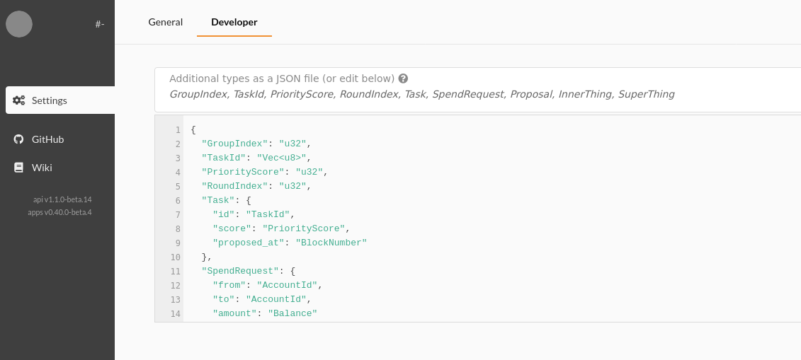

# Interact with the Kitchen Node

If you followed the instructions to [build the node](./1-build-node.md), you my proceed to launch your first blockchain.

## Launch a Development Node

Before we launch our node we will purge any chain data. If you've followed the instructions exactly, you will not yet have any chain data to purge, but on each subsequent run, you will, and it is best to get in the habbit of purging your chain now. We will start our node in development mode (`--dev`).

```bash
# Purge existing blockchain data (if any)
./target/release/kitchen-node purge-chain --dev

# Start a fresh development blockchain
./target/release/kitchen-node --dev
```

You should now see blocks created on the console.

## Launch the Apps User Interface

You can navigate to the  [Polkadot-JS Apps](https://polkadot.js.org/apps/#/settings/developer?rpc=ws://127.0.0.1:9944) user interface. This is a general purpose interface for interacting with many different Substrate-based blockchains including Polkadot. From now on we'll call it "Apps" for short. Before Apps will work with our blockchain, we need to give it a little chain-specific information known as the "types". You'll learn what all this means as you work through the recipes; for now just follow the instructions.

> Some browsers, notably Firefox, will not connect to a local node from an https website. An easy work around is to try another browser, like Chromium. Another option is to [host this interface locally](https://github.com/polkadot-js/apps#development).

If you're not already on the `Settings -> Developer`page, please navigate there. Copy the contents of `runtimes/super-runtime/types.json` into Apps.



As you work through the recipes, you will use the **Chain State** tab to query the blockchain status and **Extrinsics** to send transactions to the blockchain. Play around for a bit before moving on.
